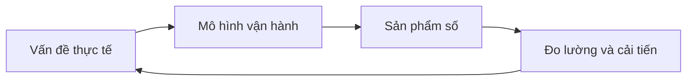

# Trần Bảo Cường

> **Full-stack Developer · F&B Operator · Product Builder**  
> Xây phần mềm từ những vấn đề có thật trong vận hành — ưu tiên tốc độ, tính ổn định và khả năng sử dụng lâu dài.


---

## Xin chào, mình là Cường

Mình là một developer đa nhiệm và người trực tiếp tham gia vận hành F&B tại TP.HCM.

Ban ngày, mình làm việc với định lượng cà phê, quy trình phục vụ, dữ liệu bán hàng và những vấn đề phát sinh tại điểm bán. Khi mở laptop, mình chuyển các trải nghiệm đó thành sản phẩm: ứng dụng POS, công cụ cân chia cà phê, mini-app, phần mềm nội bộ và cả những trò chơi có thể hoạt động ngoại tuyến.

Mình đặc biệt quan tâm đến các hệ thống **offline-first**, ứng dụng đa nền tảng, kiến trúc dễ mở rộng và những sản phẩm đủ đơn giản để người dùng có thể sử dụng ngay trong công việc hằng ngày.

> [!NOTE]
> “Viết phần mềm cũng giống như pha một shot espresso: tỷ lệ phải chuẩn, quy trình phải ổn định, nhưng vẫn cần đủ khoảng trống cho sự sáng tạo.”

---

## Mình đang xây dựng điều gì?



| Trọng tâm | Điều mình theo đuổi |
| --- | --- |
| **Sản phẩm thực dụng** | Giải quyết đúng một vấn đề cụ thể trước khi mở rộng tính năng. |
| **Offline-first** | Luồng công việc cốt lõi vẫn hoạt động khi mạng yếu hoặc mất kết nối. |
| **Hiệu năng** | Phản hồi nhanh, sử dụng tài nguyên hợp lý và không làm người dùng phải chờ. |
| **Kiến trúc bền vững** | Tách rõ core, dữ liệu, giao diện và nội dung để dễ bảo trì. |
| **Trải nghiệm con người** | Công nghệ phải hỗ trợ công việc, không biến công việc thành thao tác kỹ thuật. |

---

## Tech stack

| Lớp | Công nghệ | Cách mình sử dụng |
| :--- | :--- | :--- |
| **Ngôn ngữ** | TypeScript, JavaScript, Rust | Xử lý logic sản phẩm, ứng dụng hiệu năng cao và các module cần độ tin cậy. |
| **Web** | React, Next.js, Vite | PWA, dashboard, mini-app và giao diện quản trị. |
| **Desktop & Mobile** | Tauri v2 | Đưa một codebase lên nhiều nền tảng với footprint gọn. |
| **Cloud & Edge** | Cloudflare Workers, D1, R2 | API serverless, dữ liệu tại edge, lưu trữ tệp và đồng bộ. |
| **Kiến trúc** | Offline-first, OTA Updates, Static-first | Giữ sản phẩm ổn định, cập nhật linh hoạt và giảm phụ thuộc hạ tầng. |
| **Miền nghiệp vụ** | POS, F&B Operations, Internal Tools | Chuyển quy trình vận hành thành luồng phần mềm rõ ràng và đo lường được. |

```text
TypeScript / React / Next.js  ── giao diện và logic sản phẩm
Rust / Tauri                  ── core hiệu năng cao, ứng dụng đa nền tảng
Workers / D1 / R2             ── API, đồng bộ và lưu trữ tại edge
Offline-first / OTA           ── khả năng vận hành liên tục và cập nhật linh hoạt
```

---

## Dự án tiêu biểu

### 01. F&B và quản trị vận hành

Những công cụ được hình thành từ chính các vấn đề tại quầy, xưởng và điểm bán.

| Dự án | Trạng thái | Vai trò |
| --- | :---: | --- |
| **`CO-POS`** | 🔒 Private | Hệ thống bán hàng đa nền tảng xây bằng Tauri, React và Cloudflare; ưu tiên luồng thanh toán ổn định khi mất mạng. |
| **`can-ca-phe`** | 🔒 Private | PWA hỗ trợ cân, chia mẻ và chuẩn hóa dữ liệu nguyên liệu cà phê. |
| **`truecaffe-mini-app`** | 🌐 Public | Mini-app mở rộng trải nghiệm và điểm chạm số cho khách hàng. |
| **`KHOMAYPHA-APP`** | 🔒 Private | Ứng dụng nội bộ phục vụ quy trình xưởng, lắp ráp và hỗ trợ máy pha cà phê. |

<details>
<summary><strong>Vì sao mình tập trung vào phần mềm cho F&amp;B?</strong></summary>

F&B có nhiều bài toán nhỏ nhưng ảnh hưởng trực tiếp đến doanh thu: sai định lượng, thao tác lặp lại, dữ liệu rời rạc, mạng không ổn định và khó bàn giao quy trình. Mình xây công cụ từ góc nhìn của người vừa hiểu kỹ thuật vừa trực tiếp tham gia vận hành, nhờ đó sản phẩm bám sát thực tế hơn.

</details>

### 02. Game, nông trại và văn hóa

Không gian để mình thử nghiệm engine, mô phỏng, pixel art và cách kể chuyện bằng tương tác.

| Dự án | Trạng thái | Điểm nổi bật |
| --- | :---: | --- |
| **`co-tuong`** | 🌐 Public | Engine cờ tướng dùng Rust kết hợp giao diện TypeScript, hướng đến khả năng chơi hoàn toàn ngoại tuyến. |
| **`oni-farm`** | 🌐 Public | Game nông trại pixel art với core và content tách biệt, hỗ trợ mở rộng nội dung và cập nhật OTA. |
| **`Unimi-Coffee-Idle`** | 🔒 In development | Game idle lấy cảm hứng từ chuỗi giá trị cà phê, quản trị nguồn lực và nhịp vận hành. |

### 03. Công cụ sáng tạo và giáo dục

| Dự án | Trạng thái | Điểm nổi bật |
| --- | :---: | --- |
| **`umini-social-kit`** | 🌐 Public | Render ảnh carousel từ JSON theo một hệ thống thiết kế nhất quán. |
| **`co-learning`** | 🔒 Private | Ứng dụng học ngoại ngữ qua hình ảnh dành cho người Việt, ưu tiên hoạt động ngoại tuyến. |
| **`video-edit-kit`** | 🔒 Private | Bộ công cụ hỗ trợ chuẩn hóa và rút ngắn quy trình dựng nội dung. |
| **`Umini-work`** | 🔒 Private | Không gian tập hợp các tiện ích cho luồng công việc nội bộ. |

> [!TIP]
> **Chú thích:** 🌐 Public là dự án có thể xem mã nguồn hoặc trải nghiệm công khai; 🔒 Private là sản phẩm nội bộ hoặc đang trong giai đoạn phát triển kín.

---

## Một lát cắt kiến trúc

```text
apps/
├── web/                 # React hoặc Next.js
├── desktop/             # Tauri v2
├── mobile/              # PWA hoặc mobile shell
packages/
├── core/                # Domain logic dùng chung
├── database/            # Local-first storage và đồng bộ
├── ui/                  # Design system
└── shared/              # Types, schema và utilities
services/
├── workers/             # Cloudflare Workers
├── d1/                  # Structured data
└── r2/                  # Media và object storage
```

> [!IMPORTANT]
> Đây không phải khuôn mẫu bắt buộc cho mọi dự án. Mình chỉ tách lớp khi sự phân tách đó giúp đội ngũ phát triển nhanh hơn, kiểm thử dễ hơn hoặc giảm rủi ro khi cập nhật.

---

## Developer object

```json
{
  "name": "Trần Bảo Cường",
  "location": "Ho Chi Minh City, Vietnam",
  "roles": [
    "Full-stack Developer",
    "F&B Operator",
    "Product Builder"
  ],
  "currently_focused_on": [
    "offline-first applications",
    "cross-platform software",
    "F&B operation systems",
    "game architecture"
  ],
  "outside_of_code": [
    "coffee",
    "music",
    "martial arts",
    "travel",
    "poetry"
  ],
  "working_principle": "Build from reality, simplify with systems."
}
```

---

## Current quests

- [x] Triển khai Instant Navigation cho ứng dụng Next.js.
- [x] Đưa engine Rust lên web và app để chơi cờ tướng ngoại tuyến.
- [ ] Hoàn thiện vòng lặp gameplay cốt lõi của `Unimi-Coffee-Idle`.
- [ ] Mở rộng cơ chế đồng bộ cloud cho `CO-POS` với D1 và R2.
- [ ] Chuẩn hóa thêm các module dùng chung cho hệ sinh thái ứng dụng F&B.

<details>
<summary><strong>Nguyên tắc mình dùng để chọn việc tiếp theo</strong></summary>

1. Ưu tiên vấn đề ảnh hưởng trực tiếp đến người dùng.
2. Làm ổn định luồng cốt lõi trước khi bổ sung tính năng mới.
3. Đo lường bằng dữ liệu thực tế thay vì chỉ dựa vào cảm giác.
4. Viết tài liệu đủ rõ để dự án vẫn tiếp tục được khi bối cảnh thay đổi.

</details>

---

## Ngoài những dòng code

Mình quan tâm đến cà phê, âm nhạc, võ thuật, ngôn ngữ và văn hóa truyền thống. Những lĩnh vực này tưởng như tách biệt, nhưng đều rèn cùng một năng lực: quan sát kỹ, luyện tập đều và hiểu bản chất trước khi tìm cách cải tiến.

| Khi không viết code | Mình thường... |
| --- | --- |
| ☕ **Cà phê** | Nghiên cứu nguyên liệu, chiết xuất và quy trình vận hành quán. |
| 🎼 **Âm nhạc** | Tìm hiểu đàn tranh, violin và cấu trúc của âm thanh. |
| ✍️ **Ngôn ngữ** | Viết, học ngoại ngữ và khám phá thơ truyền thống. |
| 🥋 **Vận động** | Luyện võ và duy trì sự tập trung. |
| 🧭 **Trải nghiệm** | Đi đây đó để quan sát thêm con người, sản phẩm và cách hệ thống vận hành. |

---

## Kết nối

Mình sẵn sàng trao đổi về kiến trúc phần mềm, sản phẩm offline-first, hệ thống vận hành F&B, game engine hoặc cách chuyển một quy trình thủ công thành công cụ số dễ sử dụng.

- Website: [tranbaocuong.com](https://tranbaocuong.com)
- Threads: [@akanwaka_](https://www.threads.net/@akanwaka_)
- GitHub: tạo **Issue** hoặc **Pull Request** tại các repository public phù hợp.

> **Build from reality. Simplify with systems.**

---

<sub>Nội dung được trình bày bằng Markdown, HTML details, GitHub alerts, bảng, checklist, badges, Mermaid, JSON và cây thư mục để tương thích tốt với GitHub Profile README.</sub>
